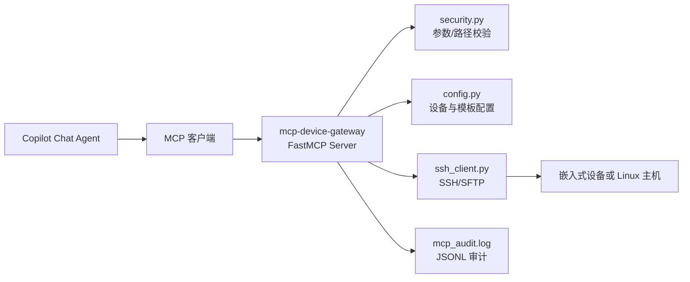

# mcp-device-gateway

面向 GitHub Copilot Chat 设计的 MCP 服务，用于打通「智能体 Agent -> 嵌入式设备 / Linux 主机」的安全执行通道。

该项目的目标不是替代运维系统，而是让 Agent 在受控边界内具备跨平台开发调试能力：

- 发现设备并验证连通性
- 远程执行预定义命令模板
- 在白名单路径内上传/下载文件
- 记录结构化审计日志，便于追溯

**快速导航**：
- [README.md](README.md)（本文档）—— 架构、安全原理、接入配置
- [devices.example.yaml](devices.example.yaml) —— 开发环境配置示例
- [devices.production.example.yaml](devices.production.example.yaml) —— 生产环境最小授权配置模板（含 SSH 密钥与 known_hosts 配置步骤）
- [PLAYBOOK.md](PLAYBOOK.md) —— Copilot Chat 实战操作手册（按任务场景提供可复用工具调用剧本）
- [start-mcp-device-gateway.bat](start-mcp-device-gateway.bat) —— Windows 一键启动脚本
- [build-exe.bat](build-exe.bat) —— 构建脱离 Python 环境的独立 exe
- [release.bat](release.bat) —— 打包发布到 PyPI

## 1. 项目定位

### 1.1 解决的问题

在 Copilot Chat 驱动的开发与排障流程中，Agent 经常需要访问远端环境（嵌入式板卡、工控机、普通 Linux 主机）以完成以下任务：

- 拉取日志和配置用于诊断
- 下发构建产物和脚本用于验证
- 触发服务重启、状态检查、健康检查

直接把 SSH 权限交给 Agent 风险很高。本项目通过 MCP 工具层进行能力收敛：

- 只暴露有限工具，而不是任意 shell
- 只允许执行配置中的命令模板
- 只允许访问 allowed_roots 白名单路径
- 每次调用写入 JSONL 审计日志

### 1.2 典型场景

- 远端启动失败排查：拉取日志 + 执行状态检查模板
- 交叉编译后验证：上传二进制到受限目录并远端执行
- 日常维护自动化：Agent 批量执行设备健康检查

## 2. 架构总览

### 2.1 目录结构

```text
src/mcp_device_gateway/
  server.py      # FastMCP 入口，定义 5 个工具，负责审计
  config.py      # YAML 配置加载与校验，冻结为数据类
  security.py    # 参数正则校验 + 路径白名单判断
  ssh_client.py  # Paramiko 封装（连接、执行、SFTP）

devices.example.yaml              # 设备与命令模板示例
devices.production.example.yaml  # 生产环境最小授权配置模板
start-mcp-device-gateway.bat     # Windows 一键启动脚本
build-exe.bat                    # 构建独立 exe（PyInstaller）
entrypoint.py                    # PyInstaller 入口（仅构建用）
release.bat                      # 打包并发布到 PyPI
```

### 2.2 运行架构



## 3. 核心流程

### 3.1 工具调用链路

1. Copilot Chat 调用 MCP 工具（如 cmd_exec）
2. server.py 根据 device_name 获取设备配置
3. 执行安全检查：
   - cmd_exec: sanitize_args
   - file_upload/file_download: is_path_allowed
4. 通过 SshDeviceClient 建立 SSH/SFTP 会话并执行
5. 返回执行结果给 Agent
6. 追加一条 JSONL 审计记录

### 3.2 cmd_exec 逻辑

1. 根据 command_key 查找 command_templates
2. 对 args 逐项做正则 fullmatch 校验
3. 使用 template.format(*args) 生成命令
4. 调用 SSH exec_command，返回 exit_code/stdout/stderr/elapsed_ms

### 3.3 文件传输逻辑

- 上传：先校验本地文件存在，再校验远端路径白名单，再执行 sftp.put
- 下载：先校验远端路径白名单，自动创建本地父目录，再执行 sftp.get

## 4. 安全原理与边界

### 4.1 参数注入防护

- args 采用固定正则：^[a-zA-Z0-9_./:=+\-]+$
- 使用 fullmatch，任何额外字符（空格、分号、反引号等）都会拒绝

### 4.2 路径越权防护

- 所有远端路径使用 PurePosixPath 规范化
- 仅允许访问 allowed_roots 前缀下的目标
- 若 allowed_roots 为空列表，表示不限制路径（请仅在可信环境使用）

### 4.3 命令执行面收敛

- Agent 不能直接执行任意 shell
- 只能通过 command_templates 中的 key 触发命令
- 模板参数使用 {0}、{1} 占位符绑定

### 4.4 主机身份校验

- 若配置 known_hosts，使用 RejectPolicy 严格校验主机指纹
- 若未配置 known_hosts，将退化为 AutoAddPolicy（便捷但风险更高）

### 4.5 审计可追溯

- 每次工具调用写入一行 JSON（JSONL）
- 字段包含时间戳、工具名、关键参数/结果摘要

## 5. 工具列表

### 5.1 device_list

返回所有已配置设备信息（名称、地址、账号、允许目录）。

### 5.2 device_ping

检测目标设备 SSH 连通性。

### 5.3 cmd_exec

按 command_key 执行命令模板。

参数：

- device_name: 设备名称
- command_key: 模板键名
- args: 可选参数数组
- timeout_sec: 超时秒数，默认 30

### 5.4 file_upload

上传本地文件到远端路径（受 allowed_roots 约束）。

### 5.5 file_download

下载远端文件到本地路径（受 allowed_roots 约束）。

## 6. 快速开始

### 6.1 安装

```powershell
cd D:/prj/mcp-device-gateway
python -m venv .venv
. .venv/Scripts/Activate.ps1
pip install -e .
```

### 6.2 配置设备

编辑 devices.example.yaml（建议复制为私有配置文件）。

示例：

```yaml
devices:
  devkit-01:
    host: 192.168.200.218
    port: 22
    username: root
    key_file: null
    password: "123456"
    known_hosts: null
    allowed_roots:
      - /opt/idm/
      - /tmp/

command_templates:
  health_check: "uname -a; uptime"
  run_make: "cd /opt/idm && make {0}"
```

### 6.3 环境变量

```powershell
$env:MCP_DEVICE_CONFIG = "D:/prj/mcp-device-gateway/devices.example.yaml"
$env:MCP_AUDIT_LOG = "D:/prj/mcp-device-gateway/mcp_audit.log"
$env:MCP_TRANSPORT = "stdio"
```

### 6.4 启动服务

方式一（推荐，已封装环境变量和依赖检查）：

```bat
start-mcp-device-gateway.bat
:: 可选参数
start-mcp-device-gateway.bat --config devices.example.yaml --transport stdio
```

方式二（直接调用 Python）：

```bat
python -m mcp_device_gateway.server
```

方式三（独立 exe，无需 Python，见第 8 节）：

```bat
dist\mcp-device-gateway\mcp-device-gateway.exe
```

## 7. 在 Copilot Chat 中接入

编辑 VS Code 的 MCP 配置（mcp.json），二选一：

**方式 A：通过启动脚本（需要 Python 环境）**

```json
{
  "servers": {
    "embedded-device-gateway": {
      "type": "stdio",
      "command": "D:\\prj\\mcp-device-gateway\\start-mcp-device-gateway.bat",
      "args": [
        "--config", "D:\\prj\\mcp-device-gateway\\devices.example.yaml",
        "--audit",  "D:\\prj\\mcp-device-gateway\\mcp_audit.log",
        "--transport", "stdio"
      ]
    }
  }
}
```

**方式 B：独立 exe（无需 Python，需先运行 build-exe.bat）**

```json
{
  "servers": {
    "embedded-device-gateway": {
      "type": "stdio",
      "command": "D:\\prj\\mcp-device-gateway\\dist\\mcp-device-gateway\\mcp-device-gateway.exe",
      "env": {
        "MCP_DEVICE_CONFIG": "D:\\prj\\mcp-device-gateway\\devices.example.yaml",
        "MCP_AUDIT_LOG":     "D:\\prj\\mcp-device-gateway\\mcp_audit.log"
      }
    }
  }
}
```

重载窗口后，可在 Copilot Chat 验证：

- device_list
- device_ping(device_name="devkit-01")

## 8. 独立 exe 构建

使用 PyInstaller 将服务打包为单目录 exe，分发时无需目标机器安装 Python。

```bat
:: 首次构建（或依赖变更后）
build-exe.bat --clean

:: 增量构建（代码修改后，速度更快）
build-exe.bat

:: 打包为单个可执行文件（启动稍慢，便于单文件分发）
build-exe.bat --onefile
```

产物位置：

```text
dist\mcp-device-gateway\
  mcp-device-gateway.exe   ← 主执行文件
  _internal\               ← 依赖库（随整个文件夹一起分发）
```

> **注意**：重新构建前若 exe 正在运行，脚本会自动 `taskkill` 终止它，以避免文件锁导致的 `PermissionError`。

## 9. 审计日志格式

日志文件由 MCP_AUDIT_LOG 指定，按 JSONL 追加。

示例：

```json
{"ts":"2026-03-29T07:52:12.124000+00:00","tool":"cmd.exec","payload":{"device":"devkit-01","command_key":"health_check","exit_code":0,"elapsed_ms":131}}
```

## 10. 配置说明

### 9.1 环境变量

- MCP_DEVICE_CONFIG: 配置文件路径，默认 ./devices.example.yaml
- MCP_AUDIT_LOG: 审计日志路径，默认 ./mcp_audit.log
- MCP_TRANSPORT: MCP 传输层，默认 stdio

### 9.2 devices 配置项

- host、username 必填
- port 默认 22
- key_file/password 二选一或并存（由 SSH 客户端协商）
- known_hosts 建议配置，提升主机身份校验安全性
- allowed_roots 建议最小授权

## 11. 开发与扩展

### 11.1 本地开发

```bat
pip install -e .
mcp-device-gateway
```

### 11.2 发布 wheel / PyPI

```bat
:: 仅构建（patch 版本号自动递增）
release.bat

:: 指定版本并发布到 PyPI
release.bat --version 1.0.0 --publish

:: 发布到 TestPyPI 验证
release.bat --test-pypi
```

### 11.3 新增工具的安全清单

新增任意远端能力时，建议遵循以下顺序：

1. 读取设备配置并校验目标设备存在
2. 执行参数与路径校验（按工具类型）
3. 使用 SshDeviceClient 执行具体操作
4. 仅返回必要结果，避免泄露敏感信息
5. 写入 _audit 记录

## 12. 常见问题

### 12.1 device_ping 失败

检查项：网络连通、端口、账号、密钥/密码、known_hosts 配置。

### 12.2 cmd_exec 提示模板不存在

确认 command_key 在 command_templates 中存在且拼写一致。

### 12.3 文件上传/下载被拒绝

优先检查远端路径是否落在 allowed_roots 白名单内。

### 12.4 build-exe.bat 报 PermissionError

`dist\mcp-device-gateway\mcp-device-gateway.exe` 正在运行时会锁住目录内文件。
脚本会自动尝试 `taskkill`；若仍失败，请手动关闭进程后重试。

## 13. 许可证

如需开源发布，请在仓库根目录补充 LICENSE 文件并在此声明。
